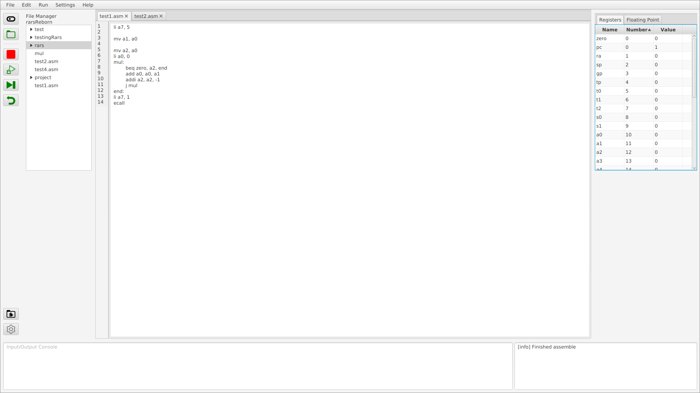

# Rars reborn
[](https://github.com/egraPA006/RarsRebornSum24)


## Description
Rars Reborn is a Risc V assembly run-time simulator. It is a try to make a replacement for [RARS](https://github.com/TheThirdOne/rars) with modern UI and support for extensions. The main goal is to create an easy-to-use tool for student education. This was developed as a summer project at Innopolis University.

## Features
- Compile Risc V assembly (RV-32I instruction set is already supported)
- See how real instructions are compiled into basic instructions
- Simulate program line by line
- Simulate full program
- See how the program changes the values of registers
- See which instruction is executed
- Add extra instruction sets, registers and system calls
- Open and edit multiple files
- Open a directory and edit any file in it

## Demo
Youtube ([click](https://www.youtube.com/watch?v=XtrfrCb8n-U "Rars Reborn [SWP24]")):
[](https://www.youtube.com/watch?v=XtrfrCb8n-U "Rars Reborn [SWP24]")

## Technological stack
- Java
- JavaFx
- Gradle
- Junit
- Mockito

## Installation

### Requirements
Java 17+

### Build from source
Build the application for your system:
#### Linux:
```bash
git clone https://gitlab.pg.innopolis.university/e.pustovoytenko/rars-reborn.git
cd rarsReborn
./gradlew assemble
cp app/build/libs/app-all.jar RarsReborn.jar
```
#### Windows:
```
git clone https://gitlab.pg.innopolis.university/e.pustovoytenko/rars-reborn.git
cd rarsReborn
gradlew assemble
copy app\build\libs\app-all.jar RarsReborn.jar
```
### Run
#### Linux:

1. Go to the directory where the jar is
1. Check the version of java (should be 17+):
```bash
java -version
```
3. Run the jar:
```bash
java -jar RarsReborn.jar
```

#### Windows:

1. Open the command line in the folder where the jar is
1. Check the version of java (should be 17+):
```bash
java.exe -version
```
3. Run the jar:
```bash
java.exe -jar RarsReborn.jar
```

## Usage
Open a file or write some code in untitled file. Press


to run full program. Press 


to run line by line. You can press


to switch to runtime mode and see details on simulation. Press


to stop simulation.


## Add extensions
> **__For customer__**: To get the idea of how easy it is to add extensions

You can add new:
- instruction sets
- system calls
- register files
### Instruction set
1. Add new instructions to ```app/src/main/java/rars/riscv/instructions```. Each instruction should implement ```BasicInstruction``` or ```PseudoInstruction``` interfaces.

2. Create a new class in ```app/src/main/java/rars/riscv/instructionSets```, which should implement ```InstructionTable```. Create a ```HashMap<String, Instruction>``` data structure, where ```String``` should be the name of instruction in risc V assembly, and implement a getter for it. 

3. Restart Rars Reborn and check if your new instruction set works. 

### System calls
1. Add new system calls to ```app/src/main/java/rars/riscv/syscalls```. Each system call should implement ```SysCall``` interface.

2. Create a new class in ```app/src/main/java/rars/riscv/sysCallTables```, which should implement ```SyscallTable```. Create a ```HashMap<Integer, SysCall>``` data structure, where ```Int``` should be the code of system call in risc V assembly, and implement a getter for it. 

3. Restart Rars Reborn and check if your new system calls work.

### Register files
>**_NOTE:_** For now only integer registers are supported
1. Add new registers to ```app/src/main/java/rars/riscv/registers```. Each system call should implement ```Register``` interface.

>**_NOTE:_** You can use one register class for several register names (For ex. ```GeneralReg``` is used for the majority of RV-32I registers)
2. Create a new class in ```app/src/main/java/rars/riscv/registerFiles```, which should implement ```RegisterTable```. Create a ```HashMap<String, Register>``` data structure, where ```String``` should be the name of register in risc V assembly, and implement a getter for it. 

3. Restart Rars Reborn and check if your new registers work.

## Roadmap
- Implement settings GUI
- Implement extension manager GUI
- Add documentation to Help
- Add greeting screen and tutorial
- Implement more instruction sets and system calls

## Authors and acknowledgment
- Egor pustovoytenko - software architecture, backend (except tokenizer and tests)
- Aziz Vundirov - backend (tokenizer and tests)
- Elisa Caruso - frontend (everything with JavaFx)

## License
[MIT license](LICENSE)
